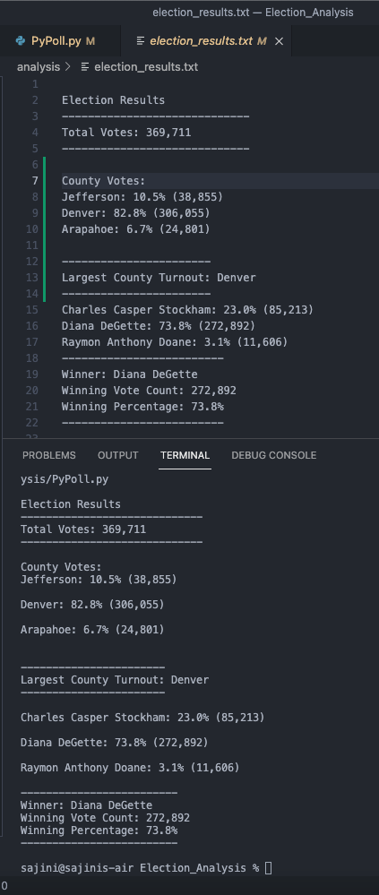

# Election_Analysis

## Overview of Election Audit
A Colorado Board of ELections employee has given the following tasks to complete the election audit of a recent local congressional election.

1. Total number of votes cast
2. A complete list of candidates who received votes
3. Total number of votes each candidate received
4. Percentage of votes each candidate won
5. The winner of the election based on popular vote

## Resources
- Data Source: election_results.csv
- Software: Python 3.9.6, Visual Studio Code, 1.59.1

## Summary
The analysis of the election audit show that:

#--------------------------------------------
- There are "369,711" votes cast in the election.

#-------------------------------------------
- The candidates were:
    - Charles Casper Stockham
    - Diana DeGette
    - Raymon Anthony Doane
- The candidate results were:
    - Charles Casper Stockham: 23.0% (85,213)
    - Diana DeGette: 73.8% (272,892)
    - Raymon Anthony Doane: 3.1% (11,606)
- The winner of the election was:
      - Diana DeGette, who received 73.8% of te vote and 272,892 number of votes.
     
#-------------------------------------------   
## Challenge Overview
After submitting the election audit results to the election commision, the commission requested the following additional data to complete the audit:

- The voter turnout for each county
- The percentage of votes from each county out of the total count
- The county with the highest turnout

## Resources
- Data Source: election_results.csv
- Software: Python 3.9.6, Visual Studio Code, 1.59.1

## Challenge - Election-Audit Results
###The analysis of the election audit shows:
- The county summary 
- The candidate summary

#-------------------------------------------

- There are "369,711" votes cast in the election.

#-------------------------------------------
- The counties were:
      - Jefferson
      - Denver
      - Arapahoe
- The county results were:
      - Jefferson: 10.5% (38,855)
      - Denver: 82.8% (306,055)
      - Arapahoe: 6.7% (24,801)
- The county with the largest turnout was: Denver

#-------------------------------------------

- The candidates were:
    - Charles Casper Stockham
    - Diana DeGette
    - Raymon Anthony Doane
- The candidate results were:
    - Charles Casper Stockham: 23.0% (85,213)
    - Diana DeGette: 73.8% (272,892)
    - Raymon Anthony Doane: 3.1% (11,606)
- The winner of the election was:
      - Diana DeGette, who received 73.8% of te vote and 272,892 number of votes.

     
## Challenge - Election-Audit Summary
This is a proposal to the election commision on how the PyPoll script can be used for other elections.
- You can change the name of the .csv resource file to a file that contains the new election data.
    - The line of code to change file_to_load = os.path.join("Resources", "different_results.csv")
- You can change the output .txt file to a different file so you don't loose the current elections_results.txt file.
    - file_to_save = os.path.join("analysis", "different.txt")
- You can parse through the row that needs to be analysed by adding that row's data to a list
    - The lines of code to include will be similar but not limited to the following:
       - variable_name = row[row number of the data you want to parse]
       - if variable_name not in list:
            (Add the variable name to the list.)
             list.append(variable_name)

